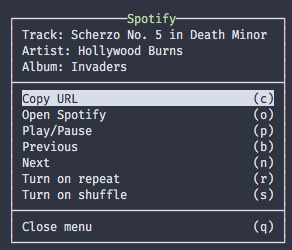

# Spotify plugin for tmux
[](https://opensource.org/licenses/MIT)

Show a nice menu to manage Spotify application.

<p align="center">
  
</p>

## Installation
### Requirements
* macOS
* tmux >= 3.0

### With Tmux Plugin Manager
Add the plugin in `.tmux.conf`:
```
set -g @plugin 'xamut/tmux-spotify'
```
Press `prefix + I` to fetch the plugin and source it. Done.

### Manual
Clone the repo somewhere. Add `run-shell` in the end of `.tmux.conf`:

```
run-shell PATH_TO_REPO/tmux-spotify.tmux
```
NOTE: this line should be placed after `set-option -g status-right ...`.

Press `prefix + :` and type `source-file ~/.tmux.conf`. Done.

## Usage
Press tmux `prefix + s` (for example, `C-a s`) and you will see a nice menu:



```
* Copy URL        (c) - copy Spotify URL of the current track to the clipboard
* Open Spotify    (o) - open/launch Spotify
* Play/Pause      (p) - toggle play/pause
* Previous        (b) - play the current track from the beggining or play the previous track
* Next            (n) - play the next track
* Turn on repeat  (r) - switch on/off current playlist's repeating
* Turn on shuffle (s) - switch on/off current playlist's shuffling
* Close menu      (q) - close menu
```

## Other plugins
* [tmux-network-bandwidth](https://github.com/xamut/tmux-network-bandwidth)
* [tmux-weather](https://github.com/xamut/tmux-weather)

## License
tmux-spotify plugin is released under the [MIT License](https://opensource.org/licenses/MIT).
